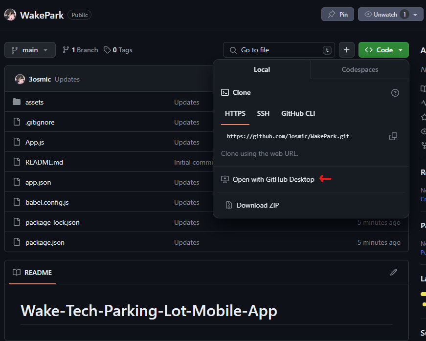

## Resources For Creating WakePark

```React JS tutorial for a sign-up page: https://www.geeksforgeeks.org/how-to-develop-user-registration-form-in-reactjs/
 
React JS beginner introduction: https://www.freecodecamp.org/news/react-beginner-handbook/

React setup: https://reactnative.dev/docs/environment-setup

Uber Clone Link: https://www.youtube.com/watch?v=_VuGmykVgTg 

Uber Clode Part 2: https://www.youtube.com/watch?v=dLHk4g55SJQ

ReactJS Tutorial: https://www.w3schools.com/REACT/DEFAULT.ASP
```

## How To Begin:
- Download github desktop
    - https://desktop.github.com
- Clone the "WakePark" repository on github



- Follow this video on how to setup up the react native environment and install expo: 
    - https://www.youtube.com/watch?v=YysKbNk1tj0&t=11s

```There is no need to create a separate project. If you installed everything and cloned the repository, that will be the project everyone will be collectively working on.```

```The only thing you will need to do is setup up the react native environment and download/install expo.```